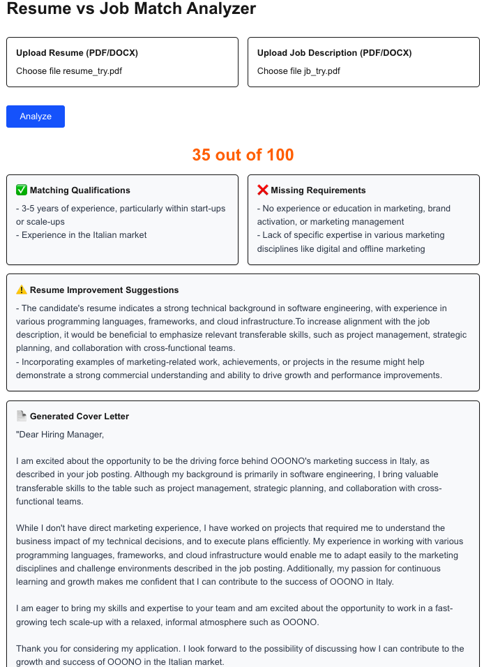

# 🤖 AI-Powered Job Matching Assistant

Looking to supercharge your job applications?  
**Upload your resume + the job description**, and let AI tell you:

✅ How well you match  
✅ What's missing  
✅ How to improve  
✅ And even generate a tailored cover letter!

---

## 🚀 How It Works

1. **Upload** your Resume (PDF)  
2. **Upload** the Job Description (PDF)  
3. **Click Submit**  
4. **Get Instant AI Analysis**, including:
   - Match Score (0–100)
   - Matched skills & experience
   - Missing requirements
   - Suggested improvements
   - A ready-to-send cover letter (based on your actual resume)

---



## 🛠️ Tech Stack

- **Frontend**: Next.js + Tailwind CSS  
- **Backend**: FastAPI (Python)  
- **LLM**: OpenRouter / GPT-based language model  
- **PDF Parsing**: `pdfplumber`

---

## 📦 Getting Started

### 1. Clone the repo

```bash
git clone https://github.com/your-username/job-matching-assistant.git
cd job-matching-assistant
